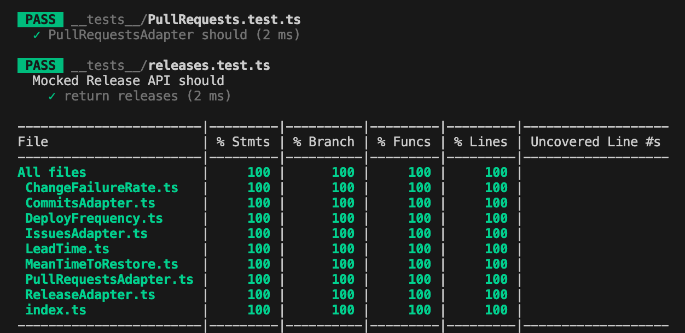
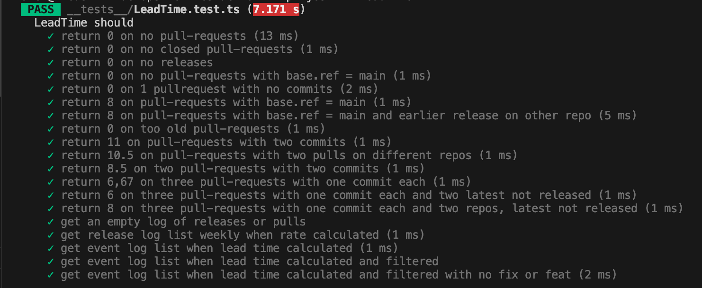
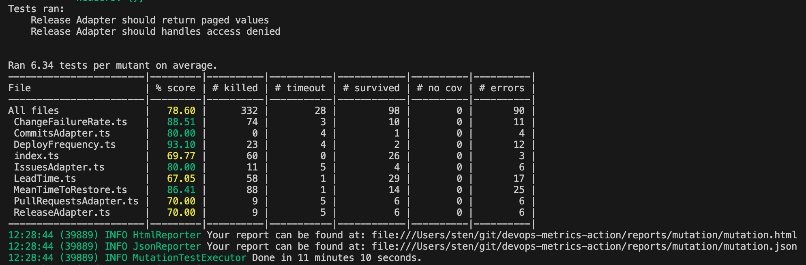
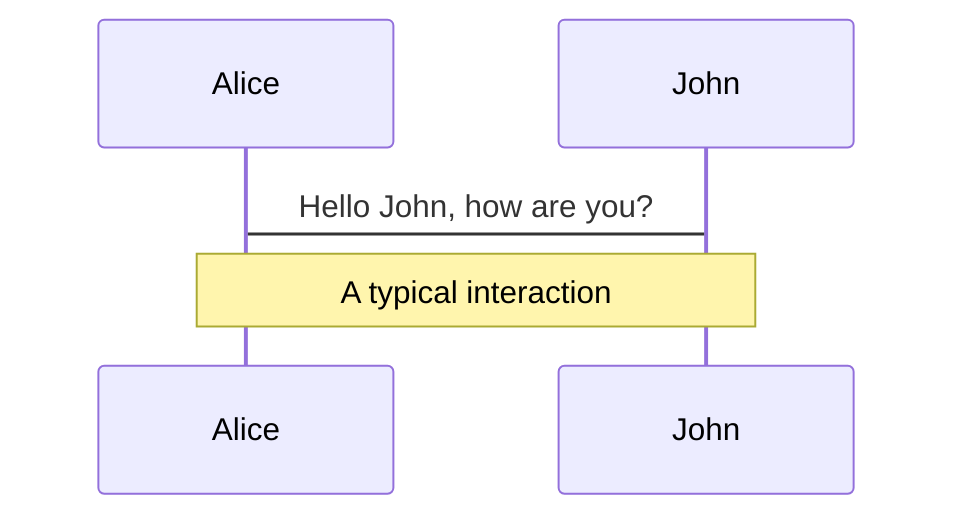
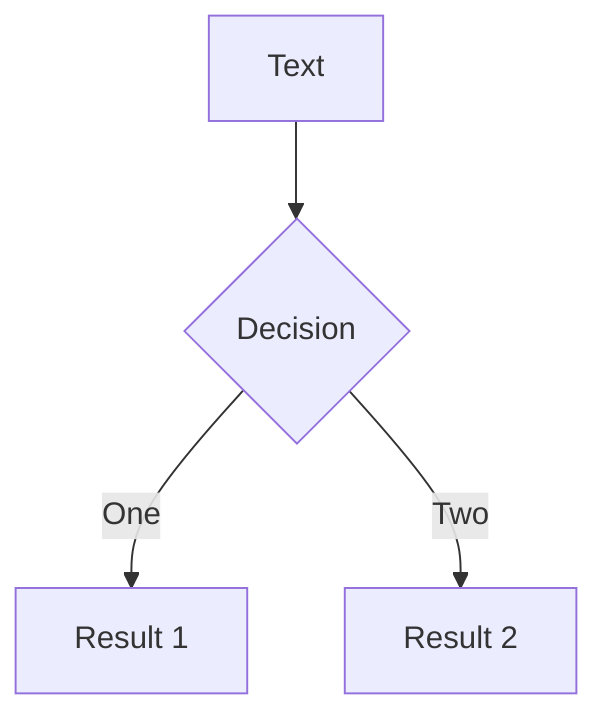
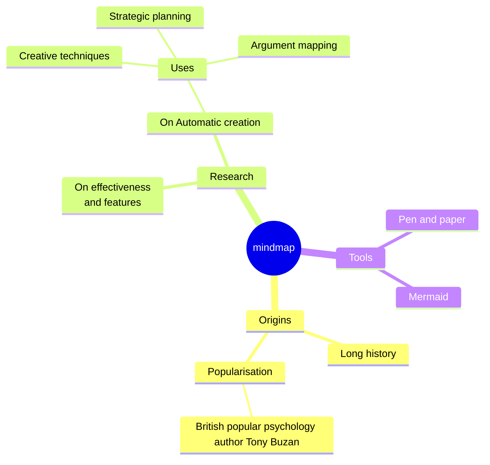
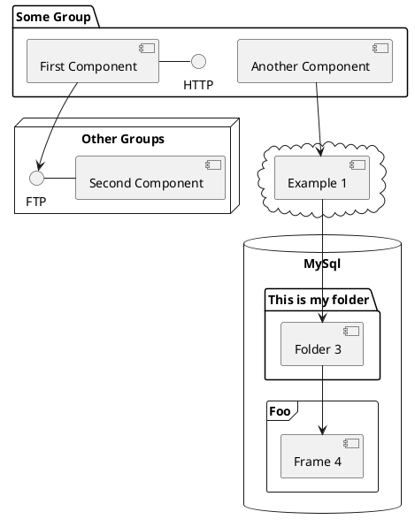

---
# You can also start simply with 'default'
theme: seriph
# random image from a curated Unsplash collection by Anthony
# like them? see https://unsplash.com/collections/94734566/slidev
background: https://stryker-mutator.io/images/stryker-man.svg
# some information about your slides (markdown enabled)
title: Using Stryker mutator
info: |
  ## Are 100% test coverage good enough?
  How to make your unit or component tests bulletproof!

# apply unocss classes to the current slide
class: text-center
# https://sli.dev/features/drawing
drawings:
  persist: false
# slide transition: https://sli.dev/guide/animations.html#slide-transitions
transition: slide-left
# enable MDC Syntax: https://sli.dev/features/mdc
mdc: true
lineNumbers: true

---

# Using Stryker Mutator

## Make your tests bullet proof!

<!--
The last comment block of each slide will be treated as slide notes. It will be visible and editable in Presenter Mode along with the slide. [Read more in the docs](https://sli.dev/guide/syntax.html#notes)
-->

---
transition: fade-out
background: -
---

# Sten Johnsen:

A tech geek spending his work and spare time figuring out stuff on electronics and software

- **Bouvet** - Since 2008, currently team-lead and (full-stack)developer
- **Experience** - Graduated 1991 - B.Eng Microelectronic computer systems. Programming since my first real job - never looked back.
- **Roles** - Programmer, project manager, program manager, department head, entrepreneur, agile coach and relationship counsellor
- **Trainer** - DevOps certification courses, Agile, Scrum
- **Busy with** - Quality of software and trying to create high performing teams

<br>

<br>

<!--
Here is another comment.
-->

---
layout: image-right
image: images/tdd-img.png
backgroundSize: contain
---

# TDD

Some benefits from TDD:
<v-clicks>
- Trustworthy code<br/>
- Better architecture<br/>
- Tests are the documentation<br/>
- Easy when debugging <br/>
and as an extra benefit: <br/>
- Enables high test coverage <br/>

</v-clicks>
```
|------------------------|---------|----------|---------|---------|-------------------|
|File                    | % Stmts | % Branch | % Funcs | % Lines | Uncovered Line #s |
|------------------------|---------|----------|---------|---------|-------------------|
|All files               |     100 |      100 |     100 |     100 |                   |
| ChangeFailureRate.ts   |     100 |      100 |     100 |     100 |                   |
| CommitsAdapter.ts      |     100 |      100 |     100 |     100 |                   |
| DeployFrequency.ts     |     100 |      100 |     100 |     100 |                   |
| IssuesAdapter.ts       |     100 |      100 |     100 |     100 |                   |
| LeadTime.ts            |     100 |      100 |     100 |     100 |                   |
| MeanTimeToRestore.ts   |     100 |      100 |     100 |     100 |                   |
| PullRequestsAdapter.ts |     100 |      100 |     100 |     100 |                   |
| ReleaseAdapter.ts      |     100 |      100 |     100 |     100 |                   |
| index.ts               |     100 |      100 |     100 |     100 |                   |
|------------------------|---------|----------|---------|---------|-------------------|
Test Suites: 13 passed, 13 total
Tests:       93 passed, 93 total
Snapshots:   0 total
Time:        6.607 s
Ran all test suites.
```

---

# What could go wrong?
    
    line 3: Covered by 18 tests<br/>
    line 4: Covered by 6 tests<br/>
     
````md magic-move {lines: true}
```ts {*|3|*}
// code
  async getLeadTime(filtered = false): Promise<number> {
    if (this.pulls.length === 0 || this.releases.length === 0) {
      return 0
    }
```

```ts {*|3|*}
// bug 1
  async getLeadTime(filtered = false): Promise<number> {
    if (this.pulls.length === 0 && this.releases.length === 0) {
      return 0
    }
```

```ts {*|3|*}
// bug 2
  async getLeadTime(filtered = false): Promise<number> {
    if (false || this.releases.length === 0) {
      return 0
    }
```

```ts {*|3|*}
// bug 3
  async getLeadTime(filtered = false): Promise<number> {
    if (this.pulls.length === 0 || true === 0) {
      return 0
    }
```

```ts {*|3|*}
// bug 4
  async getLeadTime(filtered = false): Promise<number> {
    if (this.pulls.length === 0 || this.releases.length === 0) {}
```

````

---


````md magic-move {lines: true}
```ts {*|2|*}
// step 1
const author = reactive({
  name: 'John Doe',
  books: [
    'Vue 2 - Advanced Guide',
    'Vue 3 - Basic Guide',
    'Vue 4 - The Mystery'
  ]
})
```

```ts {*|1-2|3-4|3-4,8}
// step 2
export default {
  data() {
    return {
      author: {
        name: 'John Doe',
        books: [
          'Vue 2 - Advanced Guide',
          'Vue 3 - Basic Guide',
          'Vue 4 - The Mystery'
        ]
      }
    }
  }
}
```

```ts
// step 3
export default {
  data: () => ({
    author: {
      name: 'John Doe',
      books: [
        'Vue 2 - Advanced Guide',
        'Vue 3 - Basic Guide',
        'Vue 4 - The Mystery'
      ]
    }
  })
}
```

Non-code blocks are ignored.

```vue
<!-- step 4 -->
<script setup>
const author = {
  name: 'John Doe',
  books: [
    'Vue 2 - Advanced Guide',
    'Vue 3 - Basic Guide',
    'Vue 4 - The Mystery'
  ]
}
</script>
```
````


---
transition: slide-up
level: 2
---

# Testing software

How do we know our stuff works?
Automated tests

- importance
- benefits
- metrics - test coverage
- Component/Unit tests
- Regression tests
- User Acceptance tests
- End-to-end test

---
---

# Test quality

How do we know our tests are good?


---

# Implementing in project/product development

- Using locally 
- In pull-requests
- For review
- As a quality check

---


---
<!--
You can have `style` tag in markdown to override the style for the current page.
Learn more: https://sli.dev/features/slide-scope-style
-->

<style>
h1 {
  background-color: #2B90B6;
  background-image: linear-gradient(45deg, #4EC5D4 10%, #146b8c 20%);
  background-size: 100%;
  -webkit-background-clip: text;
  -moz-background-clip: text;
  -webkit-text-fill-color: transparent;
  -moz-text-fill-color: transparent;
}
</style>

<!--
Here is another comment.
-->

---
transition: slide-up
level: 2

---

# Testing software

How do we know our stuff works?
Automated tests

- importance
- benefits
- metrics - test coverage

---
layout: image-right
image: ./images/DORA-action.png
backgroundSize: contain
---

# devops-metrics-action

<v-click>

A gihub action that calculates DORA key metrics based
on Issues, PR's and releaseses in one or more github
repositories.

</v-click>

<v-clicks>

- implemented in typescript<br/>
- 100% test coverage<br/>

</v-clicks>

<v-after>



</v-after>

---
layout: image-right
image: ./images/LeadTimeTest.png
---

# LeadTime

Lets consider the LeadTime module,
having a automated component tests
in `LeadTime.test.ts` test suite.

<v-clicks>

- more than 740 lines of code<br/>
- (probably too big)<br/>
- 19 tests<br/>
- Provides 100% test coverage<br/>


</v-clicks>

<v-click>

How do we know these tests are good?<br/>
(And by good we mean: able to detect bugs we introduce)

</v-click>


---

# LeadTime.ts

Lets test our tests to see how waterthight our testing is by considering a few lines of code in the LeadTime module:<br/>
> How many bugs can we introduce and still have all tests passing?

<v-click>

````md magic-move {lines: true}
```ts {*|6-10}{lines:true,startLine:2}
// code
  getLog(): string[] {
    return this.log
  }
  async getLeadTime(filtered = false): Promise<number> {
    if (this.pulls.length === 0 || this.releases.length === 0) {
      return 0
    }

    if (filtered) {
      this.log.push(`\nLog is filtered - only feat and fix.`)
    }
```

```ts {6}
// bug 1
  getLog(): string[] {
    return this.log
  }
  async getLeadTime(filtered = false): Promise<number> {
    if (false) {
      return 0
    }

    if (filtered) {
      this.log.push(`\nLog is filtered - only feat and fix.`)
    }
```

```ts {6}
// bug 2
  getLog(): string[] {
    return this.log
  }
  async getLeadTime(filtered = false): Promise<number> {
    if (false || this.releases.length === 0) {
      return 0
    }

    if (filtered) {
      this.log.push(`\nLog is filtered - only feat and fix.`)
    }
```

```ts {6}
// bug 3
  getLog(): string[] {
    return this.log
  }
  async getLeadTime(filtered = false): Promise<number> {
    if (this.pulls.length === 0 && this.releases.length === 0) {
      return 0
    }

    if (filtered) {
      this.log.push(`\nLog is filtered - only feat and fix.`)
    }
```

```ts {6}
// bug 4
  getLog(): string[] {
    return this.log
  }
  async getLeadTime(filtered = false): Promise<number> {
    if (this.pulls.length === 0 || false) {
      return 0
    }

    if (filtered) {
      this.log.push(`\nLog is filtered - only feat and fix.`)
    }
```

```ts {6}
// bug 5
  getLog(): string[] {
    return this.log
  }
  async getLeadTime(filtered = false): Promise<number> {
    if (this.pulls.length === 0 || this.releases.length === 0) {}

    if (filtered) {
      this.log.push(`\nLog is filtered - only feat and fix.`)
    }
```

```ts {10}
// bug 6
  getLog(): string[] {
    return this.log
  }
  async getLeadTime(filtered = false): Promise<number> {
    if (this.pulls.length === 0 || this.releases.length === 0) {
      return 0
    }

    if (true) {
      this.log.push(`\nLog is filtered - only feat and fix.`)
    }
```

```ts {10}
// bug 7
  getLog(): string[] {
    return this.log
  }
  async getLeadTime(filtered = false): Promise<number> {
    if (this.pulls.length === 0 || this.releases.length === 0) {
      return 0
    }

    if (false) {
      this.log.push(`\nLog is filtered - only feat and fix.`)
    }
```

```ts {10}
// bug 8
  getLog(): string[] {
    return this.log
  }
  async getLeadTime(filtered = false): Promise<number> {
    if (this.pulls.length === 0 || this.releases.length === 0) {
      return 0
    }

    if (filtered) {}
```

```ts {*}
// bug 8
  getLog(): string[] {
    return this.log
  }
  async getLeadTime(filtered = false): Promise<number> {
    if (this.pulls.length === 0 || this.releases.length === 0) {
      return 0
    }

    if (filtered) {
      this.log.push(`\nLog is filtered - only feat and fix.`)
    }
```

````
</v-click>

<v-click>

- 8 possible bugs in 6 lines of code

</v-click>

<v-click>

> ## Full test coverage does **not** ensure high code quality

</v-click>


---

# Test quality

In the previous example, there were also 4 bugs that caused a test to fail:<br/>

<br/>

$$
\begin{aligned}
\frac{4 \cdot detected}{4 \cdot detected + 8 \cdot undetected} &= \frac{4}{12} &= 0,33 &= 33\%
\end{aligned}
$$

<br/>

<v-clicks>

This little exercise tells us that:

- Tests are not good enough
- Tests are not useless
- We can improve the test quality

</v-clicks>

---
layout: image-right
image: ./images/test-code.png
---

# But Why?

<v-click>
Doing this exercise enables us to:
</v-click>

<v-clicks>

- Find functionality we have not tested
- Detect useless code
- Get  hints to write better tests
- Make our code more robust

</v-clicks>

<br/>

<v-click>
In this particular case I can add tests to verify edge cases the code is meant to catch, or I could delete some of the code if it turns out it's useless.<br/><br/>
</v-click>

<v-click>
BTW: The overall score for the LeadTime module tests is 67%. <br/><br/>
How do I know?
</v-click>

---
layout: image-left
image: ./images/stryker-man.png
---

# Stryker

Stryker is an automated way if testing your tests through altering your code by inserting bugs (mutants) and then running your tests to verify that the tests are catching the bugs or not.

<v-clicks>

- available for:
  - Javascript/Typescript
  - C#
  - Scala
- Produces kill-score for your tests
- All in a handy report

</v-clicks>

<v-after>



</v-after>

---

# How Stryker Works

<v-clicks>

- Filters the files to be mutated
- Determines what mutations to insert
- Performs a dry-run of all tests to verify all is passing
- Makes a copy of your code, applies one mutation and runs all tests
- Counts the status of the tests for each mutation
- Creates a report based on all mutations

</v-clicks>

---
layout: iframe
url: mutation.html
---
# Stryker report

---

# Table of contents


---

layout: image-right
image: <https://cover.sli.dev>
---

# Code

Use code snippets and get the highlighting directly, and even types hover!

```ts {all|5|7|7-8|10|all} twoslash
// TwoSlash enables TypeScript hover information
// and errors in markdown code blocks
// More at https://shiki.style/packages/twoslash

import { computed, ref } from 'vue'

const count = ref(0)
const doubled = computed(() => count.value * 2)

doubled.value = 2
```

<arrow v-click="[4, 5]" x1="350" y1="310" x2="195" y2="334" color="#953" width="2" arrowSize="1" />

<!-- This allow you to embed external code blocks -->
<<< @/snippets/external.ts#snippet

<!-- Footer -->

[Learn more](https://sli.dev/features/line-highlighting)

<!-- Inline style -->
<style>
.footnotes-sep {
  @apply mt-5 opacity-10;
}
.footnotes {
  @apply text-sm opacity-75;
}
.footnote-backref {
  display: none;
}
</style>

<!--
Notes can also sync with clicks

[click] This will be highlighted after the first click

[click] Highlighted with `count = ref(0)`

[click:3] Last click (skip two clicks)
-->

---

level: 2
---

# Shiki Magic Move

Powered by [shiki-magic-move](https://shiki-magic-move.netlify.app/), Slidev supports animations across multiple code snippets.

Add multiple code blocks and wrap them with <code>````md magic-move</code> (four backticks) to enable the magic move. For example:

````md magic-move {lines: true}
```ts {*|2|*}
// step 1
const author = reactive({
  name: 'John Doe',
  books: [
    'Vue 2 - Advanced Guide',
    'Vue 3 - Basic Guide',
    'Vue 4 - The Mystery'
  ]
})
```

```ts {*|1-2|3-4|3-4,8}
// step 2
export default {
  data() {
    return {
      author: {
        name: 'John Doe',
        books: [
          'Vue 2 - Advanced Guide',
          'Vue 3 - Basic Guide',
          'Vue 4 - The Mystery'
        ]
      }
    }
  }
}
```

```ts
// step 3
export default {
  data: () => ({
    author: {
      name: 'John Doe',
      books: [
        'Vue 2 - Advanced Guide',
        'Vue 3 - Basic Guide',
        'Vue 4 - The Mystery'
      ]
    }
  })
}
```

Non-code blocks are ignored.

```vue
<!-- step 4 -->
<script setup>
const author = {
  name: 'John Doe',
  books: [
    'Vue 2 - Advanced Guide',
    'Vue 3 - Basic Guide',
    'Vue 4 - The Mystery'
  ]
}
</script>
```
````

---

# Components

<div grid="~ cols-2 gap-4">
<div>

You can use Vue components directly inside your slides.

We have provided a few built-in components like `<Tweet/>` and `<Youtube/>` that you can use directly. And adding your custom components is also super easy.

```html
<Counter :count="10" />
```

<!-- ./components/Counter.vue -->
<Counter :count="10" m="t-4" />

Check out [the guides](https://sli.dev/builtin/components.html) for more.

</div>
<div>

```html
<Tweet id="1390115482657726468" />
```

<Tweet id="1390115482657726468" scale="0.65" />

</div>
</div>

<!--
Presenter note with **bold**, *italic*, and ~~striked~~ text.

Also, HTML elements are valid:
<div class="flex w-full">
  <span style="flex-grow: 1;">Left content</span>
  <span>Right content</span>
</div>
-->

---

class: px-20
---

# Themes

Slidev comes with powerful theming support. Themes can provide styles, layouts, components, or even configurations for tools. Switching between themes by just **one edit** in your frontmatter:

<div grid="~ cols-2 gap-2" m="t-2">

```yaml
---
theme: default
---
```

```yaml
---
theme: seriph
---
```


</div>

Read more about [How to use a theme](https://sli.dev/guide/theme-addon#use-theme) and
check out the [Awesome Themes Gallery](https://sli.dev/resources/theme-gallery).

---

# Clicks Animations

You can add `v-click` to elements to add a click animation.

<div v-click>

This shows up when you click the slide:

```html
<div v-click>This shows up when you click the slide.</div>
```

</div>

<br>

<v-click>

The <span v-mark.red="3"><code>v-mark</code> directive</span>
also allows you to add
<span v-mark.circle.orange="4">inline marks</span>
, powered by [Rough Notation](https://roughnotation.com/):

```html
<span v-mark.underline.orange>inline markers</span>
```

</v-click>

<div mt-20 v-click>

[Learn more](https://sli.dev/guide/animations#click-animation)

</div>

---

# Motions

Motion animations are powered by [@vueuse/motion](https://motion.vueuse.org/), triggered by `v-motion` directive.

```html
<div
  v-motion
  :initial="{ x: -80 }"
  :enter="{ x: 0 }"
  :click-3="{ x: 80 }"
  :leave="{ x: 1000 }"
>
  Slidev
</div>
```

<div class="w-60 relative">
  <div class="relative w-40 h-40">
    
    
    
  </div>

  <div
    class="text-5xl absolute top-14 left-40 text-[#2B90B6] -z-1"
    v-motion
    :initial="{ x: -80, opacity: 0}"
    :enter="{ x: 0, opacity: 1, transition: { delay: 2000, duration: 1000 } }">
    Slidev
  </div>
</div>

<!-- vue script setup scripts can be directly used in markdown, and will only affects current page -->
<script setup lang="ts">
const final = {
  x: 0,
  y: 0,
  rotate: 0,
  scale: 1,
  transition: {
    type: 'spring',
    damping: 10,
    stiffness: 20,
    mass: 2
  }
}
</script>

<div
  v-motion
  :initial="{ x:35, y: 30, opacity: 0}"
  :enter="{ y: 0, opacity: 1, transition: { delay: 3500 } }">

[Learn more](https://sli.dev/guide/animations.html#motion)

</div>

---

# LaTeX

LaTeX is supported out-of-box. Powered by [KaTeX](https://katex.org/).

<div h-3 />

Inline $\sqrt{3x-1}+(1+x)^2$

Block
$$ {1|3|all}
\begin{aligned}
\nabla \cdot \vec{E} &= \frac{\rho}{\varepsilon_0} \\
\nabla \cdot \vec{B} &= 0 \\
\nabla \times \vec{E} &= -\frac{\partial\vec{B}}{\partial t} \\
\nabla \times \vec{B} &= \mu_0\vec{J} + \mu_0\varepsilon_0\frac{\partial\vec{E}}{\partial t}
\end{aligned}
$$

[Learn more](https://sli.dev/features/latex)

---

# Diagrams

You can create diagrams / graphs from textual descriptions, directly in your Markdown.

<div class="grid grid-cols-4 gap-5 pt-4 -mb-6">









</div>

Learn more: [Mermaid Diagrams](https://sli.dev/features/mermaid) and [PlantUML Diagrams](https://sli.dev/features/plantuml)

---
dragPos:
  square: 0,-432,0,0
---

foo: bar
dragPos:
  square: 691,32,167,_,-16

---
dragPos:
  square: 0,-562,0,0
---

# Draggable Elements

Double-click on the draggable elements to edit their positions.

<br>

###### Directive Usage

```md

```

<br>

###### Component Usage

```md
<v-drag text-3xl>
  <carbon:arrow-up />
  Use the `v-drag` component to have a draggable container!
</v-drag>
```

<v-drag pos="663,206,261,_,-15"undefined>
  <div text-center text-3xl border border-main rounded>
    Double-click me!
  </div>
</v-drag>


###### Draggable Arrow

```md
<v-drag-arrow two-way />
```

<v-drag-arrow pos="67,452,253,46" two-way op70 />

---

src: ./pages/imported-slides.md
hide: false
---


---

# Monaco Editor

Slidev provides built-in Monaco Editor support.

Add `{monaco}` to the code block to turn it into an editor:

```ts {monaco}
import { ref } from 'vue'
import { emptyArray } from './external'

const arr = ref(emptyArray(10))
```

Use `{monaco-run}` to create an editor that can execute the code directly in the slide:

```ts {monaco-run}
import { version } from 'vue'
import { emptyArray, sayHello } from './external'

sayHello()
console.log(`vue ${version}`)
console.log(emptyArray<number>(10).reduce(fib => [...fib, fib.at(-1)! + fib.at(-2)!], [1, 1]))
```

---

layout: center
class: text-center
---

# Learn More

[Documentation](https://sli.dev) · [GitHub](https://github.com/slidevjs/slidev) · [Showcases](https://sli.dev/resources/showcases)

<PoweredBySlidev mt-10 />
